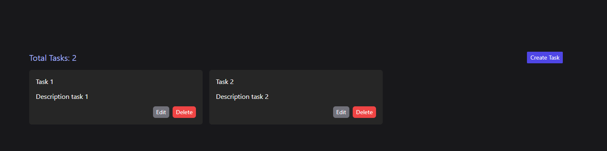

# CRUD React with Redux Toolkit and Tailwind CSS

This project is done with the purpose of being able to understand how Redux works as an application state manager and the advantages it has when using it.

[Demo](https://react-redux-toolkit-r2-d2.netlify.app/)

## Made with

* Vite
* React
* React Router 6
* Redux Toolkit
* Tailwind CSS
* Standard js